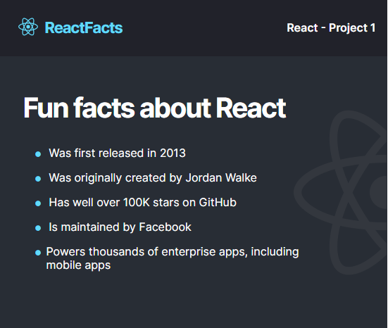

# React Fun Facts Static Webpage

A simple static webpage built using the React Front-end Framework, project 1 
of the [scrimba React course](https://scrimba.com/learn/learnreact)

## Table of contents

- [Overview](#overview)
- [Screenshot](#screenshot)
  - [Pre-Requisites](#Pre-Requisites)
  - [Setup](#Setup)
  - [Links](#links)
  - [Built with](#built-with)
- [Author](#author)

**Note: Delete this note and update the table of contents based on what sections you keep.**

## Overview
The project is part of Scrimba's course on the React course for beginners. It is a simple static website, beginner-friendly, meant to get your feat wet with React

### Screenshot

### Pre-Requisites
- ES6 Javascript Knowledge
- node
- npm
- vite(optional)
- Basic Html/Css knowledge
- A code editor eg VS code
- git

### Setup
##### Node
Make sure that you have the latest version of node installed
You can confirm by running the command `node -v` from the terminal
If you do not have it installed, kindly dollow the instructions on the [official node website](https://nodejs.org/en/), to learn how to get started

##### npm
Make sure that you have npm (node package manager) installed. It should be installed by default, when installing node js.
You can confirm by running the command `npm -v` from the terminal

##### Vite
Vite, is an alternative tool that we'll use to create our react app. Main reason to use it, is the fact that it is 10X more faster than create-react-app.
You can read more about Vite from their [website](https://vitejs.dev/)

### Setup
This are the steps to follow if you want to create your own project from scratch

Once you have made sure that you have node js and npm installed, open your code editor(vs code) and create a new folder for your project. The name of the folder should be in all lowercase, else it will result in an error when creating your react app.

Do not _cd_ into your project folder just yet, next run the command `npx create-react-app {projectname}` replace _{projectname}_ with the name of your project. It will install a few packages react, react-dom, and react-scripts, which are all necessary to run your react app.
Once that is done, cd into the project folder, and run the command `npm start` to start your project via local Host

create-react-app takes quite some time depending on your computing power, the alternative, is vite
To create your react app using vite
- run the command `npm create vite@react {projectname}`
It will prompt you to select a framework, so choose _React_
Then it will prompt you to select a variant, eg react with typescript or vanilla js react
so we'll choose vanilla js
Once that is done, it will give you a couple of instructions
    _cd project_
    _npm install_
    _npm run-dev_
Just feed in the commands one at a time
That's it

##### Clonig the project
To clone the project, you still have to have node and npm installed, in order to run the files locally
But simply open the terminal, and cd into the directry where you want to clone the repo
Then run the command `git clone https://github.com/munyite001/React-Fun-Facts-App.git`
This will clone the Repo to your local machine
To run the app, cd into the project folder and run the command `npm start`

### Links

- Live Site: [https://react-fun-facts-static.netlify.app/](https://react-fun-facts-static.netlify.app/)
- Figma Templae: [https://www.figma.com/file/LN2KRVW5a5AMPF4MUTDi3F/ReactFacts-(Copy)?node-id=0%3A4&t=LHcOQQ0qT1H9qysW-0](React Fun Facts Template)
Github Repo [https://github.com/munyite001/React-Fun-Facts-App](https://github.com/munyite001/React-Fun-Facts-App)

### Built with

- Semantic HTML5 markup
- CSS custom properties
- Flexbox
- React

## Author

- Github - [@munyite002](https://github.com/munyite001)
- Frontend Mentor - [@munyite001](https://www.frontendmentor.io/profile/munyite001)
- Twitter - [@emunyite](https://www.twitter.com/emunyite)
